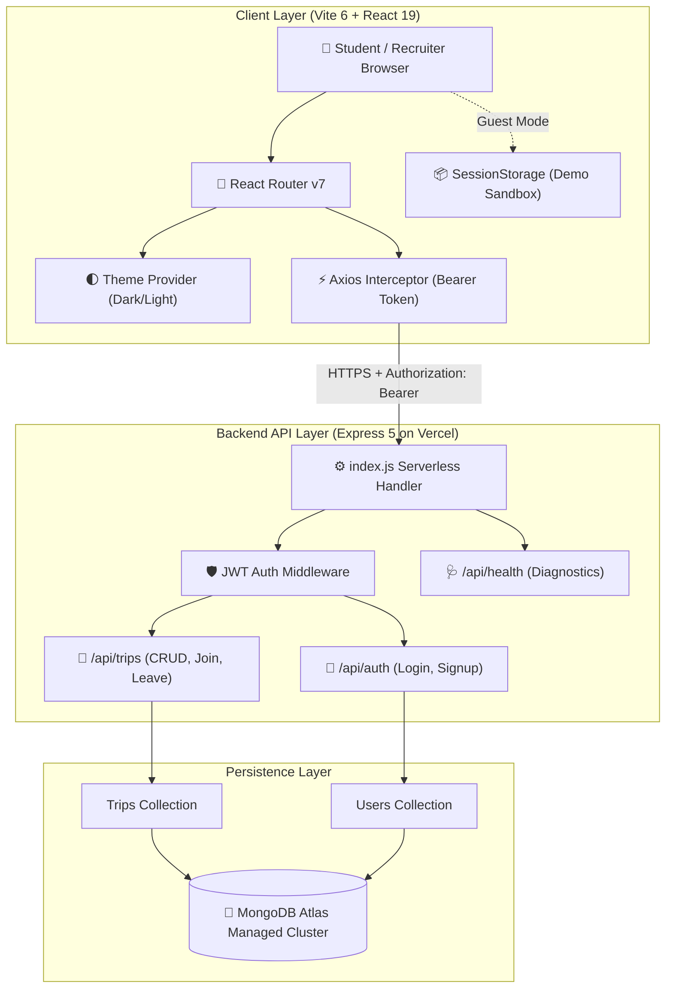

# 🚗 Campus Travel Buddy

[](https://campus-travel-buddy-ui.vercel.app/)
[](https://react.dev/)
[](https://tailwindcss.com/)
[](https://nodejs.org/)
[](https://www.mongodb.com/)
[](https://opensource.org/licenses/MIT)

> **Share the ride. Split the cost. Travel safe.**  
> An exclusive, full-stack peer-to-peer campus mobility network built for university students. Designed to eliminate solo travel costs, coordinate cab/auto shares, and provide verified campus security safeguards before stepping outside university gates.

---

## 🌐 Live Deployments & Repositories

| Component | URL | Description |
|---|---|---|
| **🖥️ Production Frontend** | [campus-travel-buddy-ui.vercel.app](https://campus-travel-buddy-ui.vercel.app) | React 19 + Tailwind v4 Client with Light/Dark Modes |
| **⚙️ Serverless REST API** | [campus-travel-buddy.vercel.app](https://campus-travel-buddy.vercel.app) | Express 5 Backend with JWT & Mongoose 9 ODM |
| **🩺 Health Diagnostics** | [campus-travel-buddy.vercel.app/api/health](https://campus-travel-buddy.vercel.app/api/health) | Live latency, database ping, and uptime monitoring |
| **🐙 GitHub Repository** | [Harsh007engineering/Campus-Travel-Buddy](https://github.com/Harsh007engineering/Campus-Travel-Buddy) | Monorepo containing full backend & frontend source |

---

## 📌 Quick Summary for Recruiters & Hiring Managers

Campus Travel Buddy is an end-to-end, production-deployed web application solving a real, everyday dilemma faced by over 12,000+ university students: **expensive single-rider transit to transit hubs (airports, railway stations, malls, and bus terminals)**.

### 💡 Core Engineering Highlights
- **Full-Stack Architecture**: Monorepo structure with decoupled React 19 SPA client and Express 5 serverless API deployed on Vercel.
- **Institutional Domain Auth**: Regex and domain validation strictly limiting registration to `@vitapstudent.ac.in` email addresses, ensuring 100% verified peer passengers.
- **Recruiter Guest / Demo Sandbox**: An isolated, zero-risk interactive demo mode that allows external reviewers and recruiters to explore and test all features (publishing rides, booking seats, split calculations) without requiring a student email.
- **Modern Big-Tech Design System**: Crafted with Tailwind CSS v4, custom geometric vector brand identity, specular frosted glassmorphism, responsive floating island header, and seamless Dark/Light theme switching.
- **Student-First Safety & Fintech Utilities**: Built-in 24/7 Campus SOS emergency desk, formatted WhatsApp roommate check-ins, and deep-linked UPI settlement (GPay/PhonePe/Paytm).

---

## ✨ Features & Functional Modules

### 1. 🎓 Campus-Restricted Authentication & Security
- **Domain Gatekeeping**: Only verified student emails ending in `@vitapstudent.ac.in` can sign up.
- **Stateful Security**: Passwords hashed with `bcryptjs` (salt rounds = 10); stateless authentication via cryptographically signed `jsonwebtoken` (JWT) with 7-day expiration.
- **Axios HTTP Interceptor**: Centralized request/response interceptors automatically injecting `Authorization: Bearer <token>` headers and handling transparent session expiry recovery.

### 2. 🧮 Interactive Fare Split & Savings Calculator (`FareCalculatorModal`)
- **Popular Route Presets**: Instant pre-fills for frequent student trips:
  - *Vijayawada Railway Station Cab* (~₹600)
  - *Vijayawada Railway Station Auto* (~₹320)
  - *Guntur Bus Stand Auto* (~₹240)
  - *Hyderabad Rajiv Gandhi Intl Airport Cab* (~₹3,200)
  - *PVP Square Mall Cab* (~₹400)
- **Real-Time Economics**: Dynamic slider/selector for 2, 3, 4, or 5 students sharing, showing real-time split cost per head and total savings vs. traveling solo.
- **One-Click Form Transfer**: "Apply to Offer Form" button instantly populates the ride-creation sidebar.

### 3. 🛡️ Campus Emergency SOS & Safety Toolkit (`SafetyToolkitModal`)
- **Official 24/7 Helplines**: Instant one-tap calling for:
  - *VIT-AP Main Security Gate* (`+91 86323 99999`)
  - *Campus Health Center / Emergency Ambulance* (`+91 86323 99998`)
  - *Andhra Pradesh Police Emergency* (`112`)
  - *Disha Women Safety Rapid Helpline* (`1091`)
- **WhatsApp Trip Check-In Generator**: 1-click pre-formatted status message containing driver name, phone number, vehicle type, and departure time to send to roommates or parents before departure.

### 4. 💸 Peer-to-Peer UPI Payment Settlement (`UpiPaymentModal`)
- **Direct Peer Transfers**: Removes the friction of cash splitting upon arriving at stations.
- **Deep-Link Protocol**: Generates standard `upi://pay` deep-links for Google Pay, PhonePe, Paytm, and BHIM with pre-populated host VPA and agreed rupee fare.
- **Zero Commission**: 100% peer-to-peer direct settlement with 0% platform commission.

### 5. 📣 Passenger Ride Request Board ("Need a Ride?")
- **Bidirectional Marketplace**: Passengers without vehicles can broadcast trip requirements (*"Need a ride to Hyderabad Airport Friday 5:00 AM, 2 people with luggage"*).
- **Direct Matching**: Drivers and groups heading that way can browse the live request board and tap **"Offer Pick-up"** to connect via WhatsApp directly.

### 6. 🚗 Multi-Mode Transit & Rich Ride Metadata
- **Vehicle Mode Badges**: Differentiates between 🚗 **Carpool**, 🛺 **Auto Share**, 🚕 **Cab Pool**, and 🏍️ **Bike Share**.
- **Luggage Allowance**: Explicit tags for 🎒 **Backpack Only** vs. 🧳 **Luggage / Trolley Allowed** (essential for holiday airport/train departures).
- **Ride Tags**: Toggle preferences like ❄️ **AC**, 🎵 **Music**, 👩 **Girls-Only**, and 🤫 **Quiet Ride**.
- **⇄ Route Reversal Button**: 1-click swap between Source and Destination when posting return commutes.

### 7. 🔒 Privacy-Guarded Contact Unlocking
- Driver and passenger contact numbers stay encrypted and hidden from public search feeds.
- Contact details, direct phone dialing, and WhatsApp chat links unlock **exclusively for confirmed passengers** on that ride.

### 8. 🎨 Big Tech Design & UX
- **Theme Switcher**: High-contrast Obsidian Zinc (`#050507`) Dark Mode and Porcelain Slate (`#f8fafc`) Light Mode with zero style flash.
- **Frosted Glass Elevation**: Multi-layer `.glass-panel` cards with diffuse shadows and specular white rim borders (`inset 0 1px 2px rgba(255, 255, 255, 0.15)`).
- **Brand Identity**: Custom vector SVG brand emblem representing interconnected university transit nodes.

---

## 🏛️ System Architecture



---

## 📡 API Specification

### 🔐 Authentication Endpoints (`/api/auth`)

| Method | Route | Access | Request Body | Response |
|---|---|---|---|---|
| `POST` | `/api/auth/signup` | Public | `{ name, email, password, phone }` | `{ token, user: { id, name, email, phone } }` |
| `POST` | `/api/auth/login` | Public | `{ email, password }` | `{ token, user: { id, name, email, phone } }` |

*Note: Both signup and login strictly enforce the `@vitapstudent.ac.in` domain.*

### 🚗 Trip Management Endpoints (`/api/trips`)

| Method | Route | Access | Description |
|---|---|---|---|
| `GET` | `/api/trips/all` | Public | Fetch all trips sorted by newest, populated with creator and passenger profiles |
| `POST` | `/api/trips/create` | Protected (JWT) | Create a new trip (source, destination, date, time, seats, cost, vehicleType, luggage, etc.) |
| `POST` | `/api/trips/join/:id` | Protected (JWT) | Join a trip; decrements `availableSeats` and appends user to `passengers` array |
| `POST` | `/api/trips/leave/:id` | Protected (JWT) | Leave a trip; increments `availableSeats` and removes user from `passengers` array |
| `PUT` | `/api/trips/edit/:id` | Protected (Creator) | Update date, time, available seats, or fare |
| `DELETE` | `/api/trips/delete/:id` | Protected (Creator) | Delete a hosted trip and cancel all passenger bookings |

### 🩺 Health Diagnostics (`/api/health`)

| Method | Route | Access | Response |
|---|---|---|---|
| `GET` | `/api/health` | Public | `{ status: "ok", timestamp, uptime, database: "connected", latency }` |

---

## 💻 Tech Stack & Dependencies

```text
campus-travel-buddy/
├── frontend/                     # Client SPA (React 19 + Vite 6)
│   ├── src/
│   │   ├── components/           # Navbar, CampusLogo, Modals (Fare, Safety, UPI)
│   │   ├── config/api.js         # Centralized Axios instance with Bearer interceptors
│   │   ├── context/ThemeContext  # Persistent Dark/Light theme state
│   │   ├── data/demoData.js      # Isolated Guest Mode sandbox database
│   │   ├── pages/                # Landing, Dashboard, Profile, Login, Signup
│   │   └── index.css             # Tailwind v4 directives & glassmorphic tokens
│   └── package.json
└── backend/                      # REST API (Express 5 + Node.js)
    ├── middleware/auth.js        # JWT token verification middleware
    ├── models/                   # User.js & Trip.js Mongoose schemas
    ├── routes/                   # auth.js, trips.js, health.js
    ├── index.js                  # Express app and Vercel serverless export
    └── vercel.json               # Serverless route routing and headers
```

---

## 🚀 Local Development Setup

### Prerequisites
- Node.js `v18.x` or higher
- npm `v9.x` or higher
- MongoDB Atlas URI or local MongoDB daemon

### 1. Clone the repository
```bash
git clone https://github.com/Harsh007engineering/Campus-Travel-Buddy.git
cd Campus-Travel-Buddy
```

### 2. Configure Backend Environment
Create `backend/.env`:
```env
PORT=5000
MONGO_URI=mongodb+srv://<username>:<password>@cluster0.mongodb.net/campustravel?retryWrites=true&w=majority
JWT_SECRET=your_strong_jwt_secret_key_here
```

### 3. Install Dependencies and Run
```bash
# Terminal 1: Backend
cd backend
npm install
npm run dev

# Terminal 2: Frontend
cd ../frontend
npm install
npm run dev
```

The frontend will start at `http://localhost:5173` and proxy requests to the local backend running at `http://localhost:5000`.

---

## 👨‍💻 Author & Engineering Profile

**Harsh Rathore**  
- **GitHub:** [@Harsh007engineering](https://github.com/Harsh007engineering)  
- **Email:** `harshrathore.hr13@gmail.com`  
- **Live App:** [https://campus-travel-buddy-ui.vercel.app](https://campus-travel-buddy-ui.vercel.app)

---

## 📄 License
This project is open-source software licensed under the [MIT License](LICENSE).
