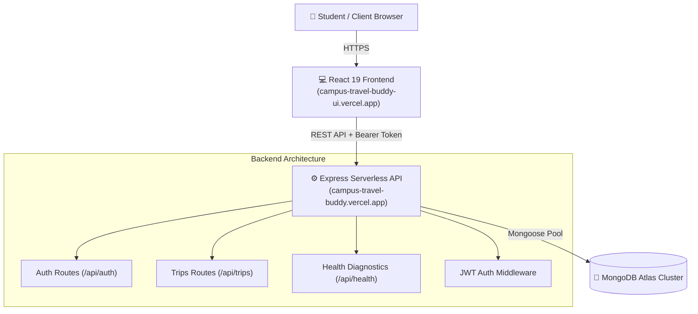

# 🚗 Campus Travel Buddy

[](https://campus-travel-buddy-ui.vercel.app/)
[](https://react.dev/)
[](https://tailwindcss.com/)
[](https://nodejs.org/)
[](https://www.mongodb.com/)

> **Share the ride. Split the cost.**  
> An exclusive, secure, peer-to-peer carpooling network built for campus students. Connect with fellow college peers, share daily commutes or weekend travels, and cut transportation costs while making campus travel safer and more social.

---

## 🌐 Live Deployments

- **🖥️ Web Application (Frontend):** [https://campus-travel-buddy-ui.vercel.app](https://campus-travel-buddy-ui.vercel.app)
- **⚙️ RESTful API (Backend):** [https://campus-travel-buddy.vercel.app](https://campus-travel-buddy.vercel.app)
- **🩺 API Health Diagnostics:** [https://campus-travel-buddy.vercel.app/api/health](https://campus-travel-buddy.vercel.app/api/health)

---

## 📸 Key Features

### 🎓 Campus Email Verification
- Only registered students with official university email domains (`@vitapstudent.ac.in`) can sign up.
- Ensures a trusted and verified peer network, keeping out unauthorized strangers.

### ✨ Guest / Demo Mode (For External Visitors & Recruiters)
- External reviewers, recruiters, and guests can explore the full application with **one click** without needing university credentials.
- **Zero Real Data Exposure**: Completely isolated simulated dataset — real student accounts and phone numbers are never exposed to guests.
- **Full Interactive Simulation**: Guests can publish demo rides, book seats with real-time seat math, manage profile trips, and search routes.

### 🚗 Offer & Discover Rides
- **Publish Trips**: Drivers can post trips with source, destination, departure date & time, seat capacity, and cost per person (₹).
- **Search & Filter**: Passengers can easily filter available rides by origin, destination, or dates in real time.
- **Seat Capacity Visualization**: Animated progress indicators showing real-time seats filled vs. total available seats.

### 🔒 Privacy-Protected Contact Sharing
- Driver and passenger phone numbers stay hidden from the public.
- Contact details are unlocked and revealed **only** to confirmed co-travelers and the ride host.

### 🎒 Ride Management Hub (Profile)
- **Trips I'm Driving**: Manage hosted trips, view joined passenger lists with their contact info, edit details, or cancel trips.
- **Trips I've Joined**: Monitor confirmed bookings with one-click seat cancellation if travel plans change.
- **Dynamic Stats**: Instant overview of your total rides offered and joined.

### 🎨 Modern Cyberpunk / Dark Glow Design
- Deep midnight violet and dark aesthetic with glassmorphic cards (`backdrop-blur`).
- Animated transitions powered by **Framer Motion**.
- Fully responsive navigation with a sleek slide-out mobile menu.
- Smooth toast alerts for instant feedback using **React Hot Toast**.
- Password visibility toggles and skeleton loaders for enhanced UX.

---

## 🛠️ Tech Stack

### Frontend
- **Framework**: React 19 + Vite 6
- **Routing**: React Router v7
- **Styling**: Tailwind CSS v4 + Custom Neon Theme Tokens
- **Icons**: Lucide React
- **Animations**: Framer Motion
- **HTTP Client**: Axios with centralized interceptors (automatic `Bearer` token injection & 401 recovery)
- **Toasts**: React Hot Toast

### Backend
- **Runtime**: Node.js
- **Framework**: Express 5
- **Database**: MongoDB Atlas with Mongoose 9 ODM
- **Authentication**: JSON Web Tokens (JWT) + BcryptJS password hashing
- **Deployment & Architecture**: Serverless deployment on Vercel with connection pooling and timeouts

---

## 🏛️ System Architecture



---

## 📡 API Reference

### 🔐 Authentication Endpoints (`/api/auth`)

| Method | Endpoint | Access | Description |
|---|---|---|---|
| `POST` | `/api/auth/signup` | Public | Register new student (requires `@vitapstudent.ac.in` email) |
| `POST` | `/api/auth/login` | Public | Authenticate user, returns JWT and user profile |

### 🚙 Trips Endpoints (`/api/trips`)

| Method | Endpoint | Access | Description |
|---|---|---|---|
| `GET` | `/api/trips/all` | Public | List all upcoming trips sorted newest first |
| `POST` | `/api/trips/create` | Protected | Offer a new ride (creator set from token) |
| `POST` | `/api/trips/join/:id` | Protected | Request and book a seat on a ride |
| `POST` | `/api/trips/leave/:id` | Protected | Cancel a booked seat and restore availability |
| `PUT` | `/api/trips/edit/:id` | Protected | Edit trip details (Driver / creator only) |
| `DELETE` | `/api/trips/delete/:id` | Protected | Delete trip (Driver / creator only) |

### 🩺 System Diagnostics

| Method | Endpoint | Access | Description |
|---|---|---|---|
| `GET` | `/api/health` | Public | Returns database connection state, env status, and latency |

---

## 🚀 Getting Started Locally

### Prerequisites
- [Node.js](https://nodejs.org/) (v18 or higher recommended)
- A free [MongoDB Atlas](https://www.mongodb.com/) cluster

### 1. Clone the Repository
```bash
git clone https://github.com/Harsh007engineering/campus-travel-buddy.git
cd campus-travel-buddy
```

### 2. Backend Setup
```bash
cd backend
npm install
```

Create a `.env` file inside `backend/`:
```env
PORT=5000
MONGO_URI=mongodb+srv://<username>:<password>@cluster0.xxxxx.mongodb.net/campusTravelBuddy?retryWrites=true&w=majority
JWT_SECRET=your_super_secret_jwt_key_here
```

Start the backend:
```bash
npm run dev
# or: node index.js
```
The server will run on `http://localhost:5000`.

### 3. Frontend Setup
Open a new terminal window:
```bash
cd frontend
npm install
```

Create a `.env` file inside `frontend/`:
```env
VITE_API_URL=http://localhost:5000/api
# Or point to production:
# VITE_API_URL=https://campus-travel-buddy.vercel.app/api
```

Start the frontend development server:
```bash
npm run dev
```
Open your browser at `http://localhost:5173`.

---

## 📁 Repository Structure

```
campus-travel-buddy/
├── .gitignore
├── README.md                  # Comprehensive Project Documentation
├── backend/
│   ├── index.js               # Server entry point & serverless connection pool
│   ├── package.json
│   ├── vercel.json            # Vercel serverless build & routing configuration
│   ├── middleware/
│   │   └── auth.js            # JWT Bearer token authentication middleware
│   ├── models/
│   │   ├── Trip.js            # Mongoose schema for trips & passengers
│   │   └── User.js            # Mongoose schema for students
│   └── routes/
│       ├── auth.js            # Signup & login routes with campus email validation
│       └── trips.js           # CRUD & seat management routes
└── frontend/
    ├── index.html
    ├── package.json
    ├── vite.config.js
    ├── vercel.json            # SPA URL rewrite rules
    ├── .env.example
    └── src/
        ├── App.jsx            # Main app router & landing page showcase
        ├── index.css          # Tailwind CSS v4 configuration & theme tokens
        ├── main.jsx           # React DOM root
        ├── config/
        │   └── api.js         # Centralized Axios instance with Bearer interceptors
        ├── components/
        │   ├── Navbar.jsx     # Responsive navbar with mobile hamburger menu
        │   └── ProtectedRoute.jsx # Client-side auth guard
        └── pages/
            ├── Dashboard.jsx  # Trip feed, search, and "Offer Ride" form
            ├── Login.jsx      # Authentication screen
            ├── Profile.jsx    # User rides management & passenger contact reveals
            └── Signup.jsx     # Registration screen
```

---

## 🛡️ Security & Privacy Highlights

- **Bcrypt Hashing**: Passwords are salted and hashed before persistence; plaintext passwords are never saved.
- **JWT Authorization**: Session management through signed JSON Web Tokens with configurable expiration.
- **Whitelisted Contact Disclosure**: Contact phone numbers are protected on the backend and only populated for active co-travelers of a trip.
- **CORS Protection**: Controlled cross-origin resource sharing headers.

---

## 👥 Contributing

Contributions, issues, and feature requests are welcome!  
Feel free to open an issue or submit a pull request on [GitHub](https://github.com/Harsh007engineering/campus-travel-buddy).

---

## 📄 License

This project is licensed under the [ISC License](LICENSE).
